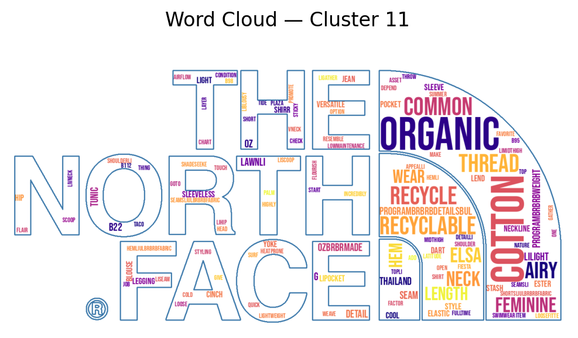
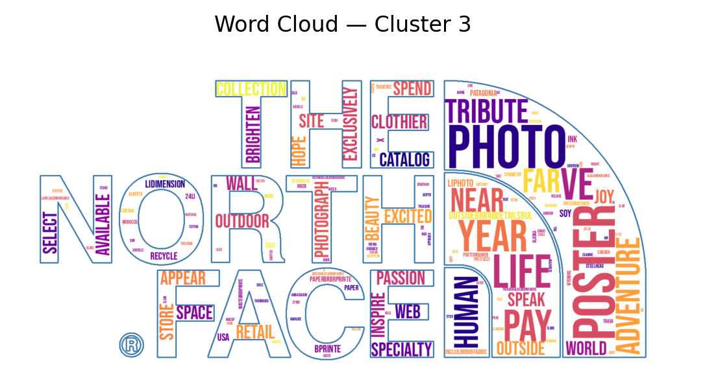

# 🧵 The North Face e-Commerce Project — Text Mining & Topic Modeling (CDSD · Jedha · Bloc 3)

## Overview
This project analyzes **product descriptions from The North Face’s e-commerce catalog** to uncover recurring patterns and themes in the brand’s product marketing.  
The objectives are to:  
- Group **products with similar descriptions** (clustering).  
- Build a **recommendation system** based on description similarity.  
- Extract **latent topics** using both **Latent Semantic Analysis (LSA)** and **BERTopic**, to better understand product themes such as sustainability, performance fabrics, and design features.  

🔗 **Colab Notebook:** [Open in Colab](https://colab.research.google.com/drive/1oBu2K04foP72i_LJI3PC_uJpbqM0CsVc#scrollTo=sH7HLmrl7F7P)  

---

## Methodology

### Text Preprocessing
- Lowercasing, punctuation & digit removal, whitespace normalization  
- Tokenization with **spaCy**  
- Lemmatization to reduce words to base form  
- Removal of stopwords and short tokens  

---

### TF-IDF Representation
- Product descriptions transformed into **TF-IDF vectors**  
- Vocabulary pruned with stopword filtering and `max_features`  
- Used as input for clustering and topic modeling  

---

## Part 1. Groups of Products with Similar Descriptions
- TF-IDF vectors clustered (KMeans / Agglomerative Clustering)  
- Clusters interpreted through **top terms** and **word clouds**  
- Example themes: eco-friendly fabrics, technical pants, sun protection gear  

---

## Part 2. Recommendation System
- Implemented a **content-based recommender** using cosine similarity on TF-IDF vectors  
- Retrieves semantically similar products given a query item  

---

## Part 3a. Topic Modeling with LSA
- Applied **TruncatedSVD (LSA)** to TF-IDF matrix  
- Extracted **latent semantic topics** and top contributing terms  
- Visualized with **topic-word score bar charts** and **word clouds**  

---

## Part 3b. Topic Modeling with BERTopic
- Leveraged **BERTopic**:  
  - Uses transformer embeddings + class-based TF-IDF (c-TF-IDF)  
  - Produces **interpretable topics** with distinctive keywords  
- Key topics identified:  
  - 🌱 **Sustainable materials** — organic cotton, recycled fibers  
  - 🧵 **Technical fabrics** — polyester, fleece, DWR coating  
  - ☀️ **Sun protection gear** — UPF ratings, brimmed hats  
  - 🎒 **Gear & accessories** — straps, mesh, compartments  
  - 👖 **Technical pants & baselayers** — zippered knees, Capilene layers  

---

## Results & Insights
- **Clustering** grouped products by material, sustainability, and functional use case  
- **Recommendation system** retrieved products with high semantic similarity  
- **LSA** extracted broad semantic dimensions across the catalog  
- **BERTopic** provided sharper and more **topic-specific keyword sets**, improving interpretability of product themes  

---

## Example Visualizations
  
  

---

## Tech Stack
- **Python**: `pandas`, `numpy`, `scikit-learn`, `spaCy`, `plotly`  
- **Models**: TF-IDF, DBSCAN, TruncatedSVD (LSA), BERTopic  
- **Visualization**: `matplotlib`, `wordcloud`, `PIL`  
- **Environment**: Google Colab / Jupyter Notebook  

